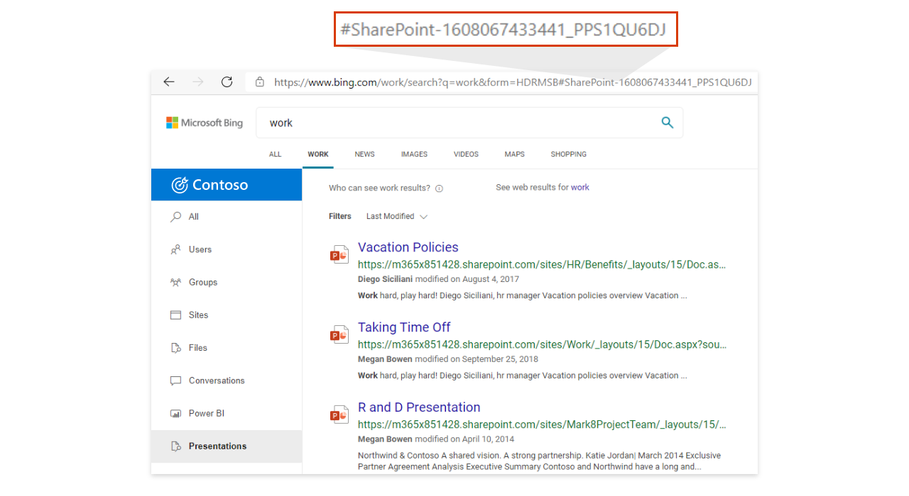

# <a name="add-a-search-box-to-your-intranet-site"></a><span data-ttu-id="2e98d-103">将搜索框添加到 Intranet 站点</span><span class="sxs-lookup"><span data-stu-id="2e98d-103">Add a search box to your intranet site</span></span>

<span data-ttu-id="2e98d-104">若要为用户提供轻松访问组织的结果，在"搜索"框中必应 Microsoft 搜索"添加到任何 Intranet 站点或页面。</span><span class="sxs-lookup"><span data-stu-id="2e98d-104">To provide your users with easy access to results from your organization, add a Microsoft Search in Bing search box to any intranet site or page.</span></span> <span data-ttu-id="2e98d-105">以下为一些优势：</span><span class="sxs-lookup"><span data-stu-id="2e98d-105">These are some of the benefits:</span></span>

- <span data-ttu-id="2e98d-106">搜索中心或 intranet SharePoint上的搜索框提供了一个熟悉、受信任的入口点以开始搜索</span><span class="sxs-lookup"><span data-stu-id="2e98d-106">A search box on your SharePoint or intranet portal provides a familiar, trusted entry point to start searching</span></span>
- <span data-ttu-id="2e98d-107">支持所有主要 Web 浏览器，包括 Google Chrome 和 Microsoft Edge</span><span class="sxs-lookup"><span data-stu-id="2e98d-107">Supports all major web browsers, including Google Chrome and Microsoft Edge</span></span>
- <span data-ttu-id="2e98d-108">仅显示来自组织的搜索建议，从不包括 Web 建议</span><span class="sxs-lookup"><span data-stu-id="2e98d-108">Only search suggestions from your organization appear, web suggestions are never included</span></span>
- <span data-ttu-id="2e98d-109">将用户从工作结果必应 Microsoft 搜索，其中不包括广告和 Web 结果</span><span class="sxs-lookup"><span data-stu-id="2e98d-109">Takes users to a Microsoft Search in Bing work results page, which excludes ads and web results</span></span>
- <span data-ttu-id="2e98d-110">控制搜索框的外观和行为，包括使用户登录默认垂直或已创建的自定义垂直方向的能力</span><span class="sxs-lookup"><span data-stu-id="2e98d-110">You control the appearance and behavior of the search box, including the ability to land users on a default vertical or a custom vertical you've created</span></span>
  
## <a name="add-a-search-box-to-an-intranet-page"></a><span data-ttu-id="2e98d-111">将搜索框添加到 Intranet 页面</span><span class="sxs-lookup"><span data-stu-id="2e98d-111">Add a search box to an intranet page</span></span>

<span data-ttu-id="2e98d-112">需要将两个元素添加到页面：适合于搜索框的容器以及支持该搜索框的脚本。</span><span class="sxs-lookup"><span data-stu-id="2e98d-112">You need to add two elements to the page: a container for the search box and the script that powers it.</span></span>
  
```html
<div id="bfb_searchbox"></div>
<script>
    var bfbSearchBoxConfig = {
        containerSelector: "bfb_searchbox"
    };
</script>
<script async src="https://www.bing.com/business/s?k=sb"></script>
```

<span data-ttu-id="2e98d-113">在 SharePoint 经典网站上，添加脚本编辑器 Web 部件并将脚本拖动到其中。</span><span class="sxs-lookup"><span data-stu-id="2e98d-113">On a SharePoint classic site, add a Script Editor Web Part and drop the script in it.</span></span>
  
## <a name="enable-the-search-box-for-mobile"></a><span data-ttu-id="2e98d-114">启用面向移动设备的搜索框</span><span class="sxs-lookup"><span data-stu-id="2e98d-114">Enable the search box for mobile</span></span>

<span data-ttu-id="2e98d-115">在面向移动用户的 Intranet 网站或页面上，将 isMobile: true 添加到设置对象：</span><span class="sxs-lookup"><span data-stu-id="2e98d-115">For intranet sites or pages available to mobile users, add isMobile: true to the settings object:</span></span>
  
```html
<div id="bfb_searchbox"></div>
<script>
    var bfbSearchBoxConfig = {
        containerSelector: "bfb_searchbox", 
        isMobile: true
    };
</script>
<script async src="https://www.bing.com/business/s?k=sb"></script>
```

## <a name="put-focus-on-the-search-box-by-default"></a><span data-ttu-id="2e98d-116">默认情况下，已将焦点置于搜索框上</span><span class="sxs-lookup"><span data-stu-id="2e98d-116">Put focus on the search box by default</span></span>

<span data-ttu-id="2e98d-117">为了帮助用户更快地进行搜索，在加载页面或网站时，通过将 focus: true 添加到设置对象来将光标置于搜索框中：</span><span class="sxs-lookup"><span data-stu-id="2e98d-117">To help users search faster, when the page or site loads place the cursor in the search box by adding focus: true to the settings object:</span></span>
  
```html
<div id="bfb_searchbox"></div>
<script>
    var bfbSearchBoxConfig = {
        containerSelector: "bfb_searchbox",
        focus: true
    };
</script>
<script async src="https://www.bing.com/business/s?k=sb"></script>
```

## <a name="customize-the-appearance-of-the-search-box"></a><span data-ttu-id="2e98d-118">自定义搜索框的外观</span><span class="sxs-lookup"><span data-stu-id="2e98d-118">Customize the appearance of the search box</span></span> 

<span data-ttu-id="2e98d-119">为了帮助搜索框更好地适应 Intranet 的样式，你可以使用各种配置选项。</span><span class="sxs-lookup"><span data-stu-id="2e98d-119">To help the search box better fit with the style of your intranet, there are a variety of configuration options you can use.</span></span> <span data-ttu-id="2e98d-120">混合和匹配各种选项以满足你的需求。</span><span class="sxs-lookup"><span data-stu-id="2e98d-120">Mix and match options to suit your needs.</span></span>

```html
<div id="bfb_searchbox"></div>
<script>
    var bfbSearchBoxConfig = {
        containerSelector: "bfb_searchbox",
        width: 560,                             // default: 560, min: 360, max: 650
        height: 40,                             // default: 40, min: 40, max: 72
        cornerRadius: 6,                        // default: 6, min: 0, max: 25                                   
        strokeOutline: true,                    // default: true
        dropShadow: true,                       // default: false
        iconColor: "#067FA6",                   // default: #067FA6
        title: "Search box",                    // default: "Search box"
        vertical: "Person-people",              // default: not specified, search box directs to the All vertical on the WORK results page
        companyNameInGhostText: "Contoso"       // default: not specified
                                                // when absent, ghost text will be "Search work"
                                                // when specified, text will be "Search <companyNameInGhostText>"
    };
</script>
<script async src="https://www.bing.com/business/s?k=sb"></script>
```

## <a name="direct-users-to-a-default-or-custom-vertical"></a><span data-ttu-id="2e98d-121">将用户引导到默认或自定义垂直方向</span><span class="sxs-lookup"><span data-stu-id="2e98d-121">Direct users to a default or custom vertical</span></span>

<span data-ttu-id="2e98d-122">为了在业务线应用或 Intranet 站点和工作结果之间轻松集成，您还可以通过指定用户单击搜索建议时应登录的默认或自定义垂直搜索框来自定义搜索框。</span><span class="sxs-lookup"><span data-stu-id="2e98d-122">To provide easy integration between your line-of-business apps or intranet sites and your work results, you can also customize the search box by specifying a default or custom vertical that users should land on when they click a search suggestion.</span></span>

<span data-ttu-id="2e98d-123">使用 bfbSearchBoxConfig 中的垂直选项定义您想要的垂直方向。</span><span class="sxs-lookup"><span data-stu-id="2e98d-123">Use the vertical option in bfbSearchBoxConfig to define the vertical you want.</span></span> <span data-ttu-id="2e98d-124">例如，如果您希望用户始终登录"网站"垂直（默认垂直距离之一）上，请使用值"Site-sites"。</span><span class="sxs-lookup"><span data-stu-id="2e98d-124">For example, if you want users to always land on the Sites vertical, one of the default verticals, use the value "Site-sites".</span></span>


<span data-ttu-id="2e98d-126">对于自定义垂直方向，使用 URL 末尾的哈希。</span><span class="sxs-lookup"><span data-stu-id="2e98d-126">For custom verticals, use the hash at the end of the URL.</span></span> <span data-ttu-id="2e98d-127">您可以通过从 必应 的工作页进行搜索、单击垂直标签，以及复制数字符号后的值 (#) 。</span><span class="sxs-lookup"><span data-stu-id="2e98d-127">You can find these values by searching from the work page on Bing, clicking a vertical label, and copying the value after the number sign (#).</span></span>



## <a name="use-an-iframe-to-embed-a-search-box"></a><span data-ttu-id="2e98d-129">使用 iFrame 嵌入搜索框</span><span class="sxs-lookup"><span data-stu-id="2e98d-129">Use an iFrame to embed a search box</span></span>

<span data-ttu-id="2e98d-130">如果嵌入脚本并非网站上的一个选项，请使用 iFrame 添加搜索框。</span><span class="sxs-lookup"><span data-stu-id="2e98d-130">If embedding a script isn't an option for the site, use an iFrame to add the search box.</span></span> <span data-ttu-id="2e98d-131">无法自定义搜索框。</span><span class="sxs-lookup"><span data-stu-id="2e98d-131">You won't be able to customize the search box.</span></span>
  
```html
<iframe width="564" height="400" src="https://www.bing.com/business/searchbox"></iframe>
```

## <a name="inprivate-mode-and-conditional-access"></a><span data-ttu-id="2e98d-132">InPrivate 模式和条件访问</span><span class="sxs-lookup"><span data-stu-id="2e98d-132">InPrivate mode and Conditional Access</span></span>

<span data-ttu-id="2e98d-133">如果在 InPrivate 窗口中打开页面或网站，将禁用嵌入搜索框。</span><span class="sxs-lookup"><span data-stu-id="2e98d-133">An embedded search box will be disabled if the page or site is opened in an InPrivate window.</span></span> <span data-ttu-id="2e98d-134">此外，使用 Microsoft Edge 中的 Azure AD 条件访问必应，在使用 InPrivate 模式时，必应.com 不支持 AAD 登录。</span><span class="sxs-lookup"><span data-stu-id="2e98d-134">Also, with Azure AD Conditional Access support in Microsoft Edge, Bing.com doesn't support AAD sign in when using InPrivate mode.</span></span> <span data-ttu-id="2e98d-135">有关 Edge 中的条件访问详细信息，请参阅Microsoft Edge[和条件访问](https://docs.microsoft.com/deployedge/ms-edge-security-conditional-access#accessing-conditional-access-protected-resources-in-microsoft-edge)。</span><span class="sxs-lookup"><span data-stu-id="2e98d-135">For more information about Conditional Access in Edge, see [Microsoft Edge and Conditional Access](https://docs.microsoft.com/deployedge/ms-edge-security-conditional-access#accessing-conditional-access-protected-resources-in-microsoft-edge).</span></span> 