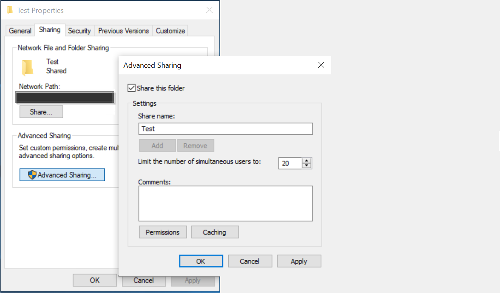

<!---Previous ms.author: rusamai --->

# 文件共享 Graph 连接器

文件共享 Graph 连接器允许组织中用户搜索本地 Windows 文件共享。

> [!NOTE]
> 阅读 [**Graph 连接器的安装程序文章**](configure-connector.md) ，了解一般的 Graph 连接器设置过程。

## 在开始使用之前

### 安装 Graph 连接器代理

若要为 Windows 文件共享编制索引，必须安装和注册 Graph 连接器代理。 请参阅 ["安装 Graph 连接器代理"](on-prem-agent.md) 了解更多信息。  

### 内容要求

### 文件类型

可索引和搜索以下格式的内容：DOC、 DOCM、DOCX、DOT、DOTX、EML、GIF、HTML、JPEG、MHT、MHTML、MSG、NWS、OBD、OBT、ODP、ODS、ODT、ONE、PDF、POT、PPS、PPT、PPTM、PPTX、TXT、XLB、XLC、XLSB、XLS、XLSX、XLT、XLXM、XML、XPS 和 ZIP。 仅对这些格式的文本内容编制索引。 将忽略所有多媒体内容。 对于不属于此格式的任何文件，仅对元数据编制索引。

### 文件大小限制

支持的最大文件大小为 100 MB。 超过 100 MB 的文件不会编制索引。 处理后的最大大小限制为 4 MB。 当文件大小达到 4 MB 时，处理将停止。 因此，文件中存在某些短语可能无法用于搜索。

## 步骤 1：在 Microsoft 365 管理中心中添加 Graph 连接器

按照常规 [设置说明操作](https://docs.microsoft.com/microsoftsearch/configure-connector)。
<!---If the above phrase does not apply, delete it and insert specific details for your data source that are different from general setup instructions.-->

## 步骤 2：命名连接

按照常规 [设置说明操作](https://docs.microsoft.com/microsoftsearch/configure-connector)。
<!---If the above phrase does not apply, delete it and insert specific details for your data source that are different from general setup instructions.-->

## 步骤 3：配置连接设置

在 **"连接到数据源"** 页上，选择 **"** 文件共享"并提供名称、连接 ID 和说明。 下一页，提供文件共享的路径并选择之前安装的 Graph 连接器代理。 输入对文件共享中所有文件的读取访问权限的 [Microsoft Windows](https://microsoft.com/windows) 用户帐户的凭据。

### 保留上次访问时间

当连接器尝试对文件进行爬网时，将更新其元数据中的"上次访问时间"字段。 如果依赖于该字段进行任何存档和备份解决方案，并且不希望在连接器访问它时对其进行更新，可以在"高级设置"页 **中配置** 此选项。

## 步骤 4：管理搜索权限

通过在"管理搜索权限"页中选择所需的选项，可以限制基于"共享访问控制列表"或"新技术文件系统 (NTFS) 访问控制列表"搜索任何 **文件的权限。** 这些访问控制列表中提供的用户帐户和组必须由 Active Directory (AD) 。 如果使用任何其他系统进行用户帐户管理，可以选择"任何人"选项，这样用户就可以搜索所有文件，而没有任何访问限制。 但是，当用户尝试打开文件时，将应用在源上设置的访问控制。

请注意，默认情况下，当在网络共享文件夹时，Windows 为 Share ACL 中的"任何人"提供"读取"权限。 通过扩展名，如果您在"管理搜索权限"中选择了"共享 ACL"，则用户将能够搜索所有文件。 如果要限制访问，请删除文件共享中"任何人"的"读取"访问权限，并仅向所需的用户和组提供访问权限。 然后，连接器读取这些访问限制，并应用它们进行搜索。

只有在提供的共享路径遵循 UNC 路径格式时，才能选择"共享 ACL"。 可以通过在"共享"选项下进入"高级共享"来创建 UNC 格式的路径。

## 步骤 5：分配属性标签

按照常规 [设置说明操作](https://docs.microsoft.com/microsoftsearch/configure-connector)。
<!---If the above phrase does not apply, delete it and insert specific details for your data source that are different from general setup instructions.-->

## 步骤 6：管理架构

按照常规 [设置说明操作](https://docs.microsoft.com/microsoftsearch/configure-connector)。
<!---If the above phrase does not apply, delete it and insert specific details for your data source that are different from general setup instructions.-->

## 步骤 7：选择刷新设置

按照常规 [设置说明操作](https://docs.microsoft.com/microsoftsearch/configure-connector)。
<!---If the above phrase does not apply, delete it and insert specific details for your data source that are different from general setup instructions.-->

## 步骤 8：查看连接

按照常规 [设置说明操作](https://docs.microsoft.com/microsoftsearch/configure-connector)。
<!---If the above phrase does not apply, delete it and insert specific details for your data source that are different from general setup 
instructions.-->

<!---## Troubleshooting-->
<!---Insert troubleshooting recommendations for this data source-->

<!---## Limitations-->
<!---Insert limitations for this data source-->
