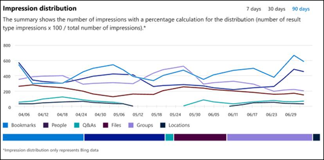

# Microsoft Search Insights 仪表板报告Microsoft Search Insights dashboard reports

您可以使用 Microsoft Search Insights 仪表板来管理已发布的答案的[必应](https://Bing.com)数据。You can use the Microsoft Search Insights dashboard to manage [Bing](https://Bing.com) data for your published answers. 这只是[使内容易于查找](make-content-easy-to-find.md)您的用户所需的步骤之一。This is just one of the steps needed to [make content easy to find](make-content-easy-to-find.md) for your users.

首次转到 Microsoft 365[管理中心](https://admin.microsoft.com)中的 microsoft 搜索时，请在 "见解" 仪表板上输入。When you first go to Microsoft Search in the Microsoft 365 [admin center](https://admin.microsoft.com), you enter on the Insights dashboard.

"见解" 仪表板上提供了以下报告。The following reports are available on the Insights dashboard.

> [!NOTE]
> 报告中的数据仅表示[必应](https://Bing.com)数据。The data in the reports only represents [Bing](https://Bing.com) data.

## 热门查询Top queries

此报告提供用户运行的前 2000[必应](https://Bing.com)搜索查询的详细信息。This report gives details about the top 2000 [Bing](https://Bing.com) search queries that users run. 若要在**Top 查询**中显示查询，查询必须至少有三次单击。For a query to appear in **Top queries**, the query must get at least three clicks.

较低的即点即用速率（CTR）意味着用户找不到要查找的内容。A low click-through rate (CTR) means that users aren’t finding what they’re looking for.

您可以通过筛选答案的类型来选择报告的不同视图。You can choose different views of the report by filtering on the type of answer. 例如，如果只想查看书签的顶部查询，请选择报表右上角的下拉箭头，然后选择 "**书签**"。For example, if you just want to view the top queries for Bookmarks, select the drop-down in the upper-right corner of the report, and then select **Bookmarks**. 默认情况下，将显示**所有**答案类型。By default, **All** answer types are shown.

## 印记分布Impression distribution

此报告显示[必应 Bing](https://Bing.com)分布在 Bing 一段时间内的各种答案。This report shows impression distribution in [Bing](https://Bing.com) over time for various answers. 示例包括书签、人员、问答&、文件、位置、文件网站、组和对话。Examples are bookmarks, people, Q&A, files, locations, file sites, groups, and conversations. 

"印象分布" 可帮助管理员了解在指定时间段内用户查找的内容。Impression distribution can help admins understand what users look for during a specified period.
