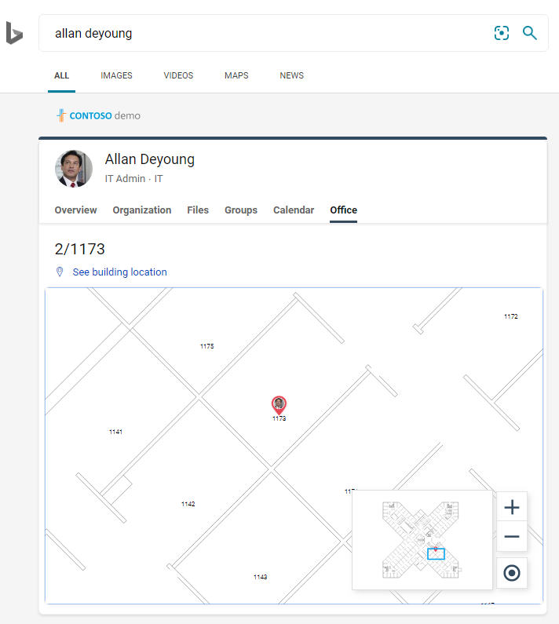

# 管理基底计划

Microsoft Search 平面图计划可帮助用户在大楼中查找人员和会议室。 平面图计划回答以下问题：
- Allan Deyoung 的办公室在哪里？
- 会议室 C1 在什么位置？

为了便于查找类似这些问题的答案，有关组织建筑物、办公室和设施的信息需要提供，并可供搜索。 大型组织通常具有设施或空间管理团队，并且可能已提供此信息。 在小型组织中，搜索管理员可能需要创建并添加它。

## 开始之前的48小时
开始上载平面布置图之前，需要为用户的办公室位置编制索引。 根据组织的规模，最长可能需要48个小时才能完成。 如果忽略此步骤，则会在执行过程时收到错误。

在 microsoft 365[管理中心](https://admin.microsoft.com)，转到 "**设置** > **Microsoft Search** > **平面计划**"，然后选择 "**开始**"。

如果看不到此通知，则你或你的组织中的某个人已启动此步骤。

## 注意事项
若要帮助用户查找有关办公室和建筑设施的信息，您需要添加以下内容：

|方面     |这一点为什么重要？  |
|---------|---------|
|建筑物位置    |    你需要将每个建筑物添加到 Microsoft 搜索位置。 应为每个建筑物提供标准命名格式。 您可以使用街道地址或地图坐标添加建筑物。     |
|所有用户帐户上的**Office**属性     |    每个用户帐户都需要将**office**属性与其办公室位置相关。 并且办公室位置应遵循标准格式，包括建筑物、楼层和会议室信息。     在 Azure AD 中，此属性称为 " **PhysicalDeliveryOfficeName**"。    |
|DWG 格式的楼面平面图文件     |   您需要对建筑物的每个楼层或翼形使用单独的平面图，并将 office 信息包含在用户的 Office 属性中使用的相同格式。 文件必须采用 AutoCAD 绘图 DWG 格式。 |

有关详细信息，请参阅[Microsoft Search 平面图计划的最佳实践](floorplans-bestpractices.md)。

## 建筑物位置

确定需要作为位置添加的建筑物。 建筑物的位置地址和映射坐标是第一个标识点。 如果尚未将建筑物添加为位置，管理员需要添加它。 有关详细信息，请参阅[管理位置](manage-locations.md)。

## 平面布置图文件

在构建已确定后，您可以添加其楼面计划。 所有平面布置图的文件必须采用 DWG 格式。 如果您的组织尚不具备这些计划，则需要在与 DWG 兼容的应用中创建平面布置图。 平面布置图必须正确映射所有聊天室，包括会议或会议室、restrooms、kitchens、邮件室和建筑物的每个基底的其他设施，以启用搜索。

### 办公室位置

若要映射到平面布置图，所有办公地点和员工办公室数据都必须在用户帐户中。 在平面图中，办公室位置必须是唯一的，并且不能重复。 例如，如果两个人共享 office 2/1173，则**2/1173**在你的平面布置图中只能有一个唯一的实例，但 Azure AD 中的用户帐户将具有相同的办公室位置。

 > [!Note] 
 > 当用户搜索同事的会议室或办公地点时，平面布置图中的房间号码将与 Azure AD 中的 office 位置相匹配。 如果找到匹配项，则显示地图。

## 添加楼面计划

 第一次转到平面图时，您可能会在页面顶部看到一条注释，指出， *Microsoft 需要先收集和组织办公室位置，然后才能上载平面布置图*。 选择 "**开始**"，为 Azure AD 办事处位置编制索引。 

1. 在[管理中心](https://admin.microsoft.com)中，转到 "**设置** > **Microsoft Search** >**平面计划**"，然后选择 "**添加平面图**"。
4. 在下拉箭头中选择建筑物，然后选择 "**下一步**"。 如果未列出建筑物，则需要将其添加到 "位置"。 有关详细信息，请参阅[管理位置](manage-locations.md)。
6. 选择 "**上载文件**"，然后选择要上传的平面布置图。 
1. 文件上载成功后，您需要确定楼层号或翼号如何表示。 
7. 输入标识建筑物的代码。 可以在**Office location**属性中的用户帐户上找到生成代码。 例如，如果用户的办公室位置是**2/1173**，则生成代码为**2**。 
9. 查看并确定所有上载的平面布置图的位置模式，然后选择 "**下一步**"。
10. 准备就绪后，请选择 "**发布**" 以使平面布置图可供搜索。

> [!Note] 
> 当平面图处于草稿状态时，该计划不完整。 草稿允许风险承担者在上载和创建平面布置图时进行协调。 它还允许您分阶段部署平面布置计划。

## 编辑平面布置图

1. 在[管理中心](https://admin.microsoft.com)中，转到 "**设置** > **Microsoft Search** > **平面计划**"。 
1. 选择 "**已发布**" 或 "**草稿**"，选择要更改的平面布置图，然后选择 "**编辑**"。
5. 进行更改，然后选择 "**保存**"。

## 错误疑难解答

在解决所有错误之前，不能转到下一步来定义楼层、翼形和会议室信息。 下表文件上载错误消息和用于修复问题的操作。

| 错误消息   | 类型    | Action       |
|:----------------| :--------- | :-------------- |
| 无法读取 CC_1。 请重新上载或删除楼面计划。 | Error |  请再次尝试上载文件。 如果不起作用，请删除该文件，然后再试一次。 |
| 有两个名为 CC_1 的文件。 请删除其中一个名称，或使用另一个名称重新上载。| Error | 如果文件名不正确，请通过添加 floor 或翼形信息来使文件名成为唯一的，然后重新上传文件。   如果意外添加了同一文件两次，只需将其删除即可。 |
| 找不到数据。 | Error | 请检查您的文件以确保其正确无误，然后重新上传，或将其删除。 |
| 此文件中缺少外部引用。 请上载 "CC_1_furniture" 或删除此文件。 | 警告 | 上载外部引用文件或删除。|
| 无法读取 DWG 文件中的会议室编号或标签。 请删除此文件。 | 警告 | 请检查 DWG 文件以确保包含数据，然后删除该文件，然后重试。 |
