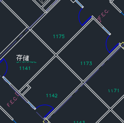
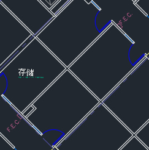

# 管理基底计划

**Microsoft Search**中的平面布置图可帮助用户在大楼中查找人员和会议室。 平面布置图回答以下问题：

- Allan Deyoung 的办公室在哪里？
- 建筑物2第3层
- 查找2/11173

## 添加楼面计划

按照以下步骤在**Microsoft Search**中设置平面布置图的答案。

### 步骤1：确定建筑物代码

生成代码用作用户办公室位置的一部分。 更新用户配置文件时，将使用这些代码。 假设您的组织在此位置有一个建筑物：*建筑物2、350/5 号、纽约城市、纽约州 10016*

下面是此建筑物代码的一些很棒的示例：2、B2、Building2、大楼2或 NYCB2。 每个建筑物都必须具有唯一的代码。

### 步骤2：查看你的平面图

平面布置图文件必须采用 DWG 格式;DWG 文件可以包含文本标签。 当文本标签标记聊天室时，它称为会议室标签。 DWG 文件必须至少有**10 个会议室**标记有标签。 下面是具有不同标签类型的 DWG 文件的一些示例：

|**包含会议室标签的文本标签**|**文本标签但无会议室标签**|**无文本标签**|
|:-----:|:-----:|:-----:|
||||

有关查看和更新 DWG 文件的信息，请参阅[FAQ](#frequently-asked-questions)部分。

### 步骤3：更新用户配置文件上的 office 位置

用户的办公室位置是建筑物代码和会议室标签的组合。 例如，如果生成代码为*2* ，而房间标签是*1173*，则办公室位置将为*2/1173*。

为组织中的每个用户添加或更新办公地点。 您可以更改 Microsoft 365[管理中心](https://admin.microsoft.com)中的用户配置文件上的 office 位置，也可以在本地 Active directory 中更改为同步到 Azure Active directory。 *PhysicalDeliveryOfficeName*是用于办公地点的域。 如果你的会议室标签不包括楼层号，请参阅提示的常见问题解答。

在此示例中，Allan 的办公室位于建筑物2的第1层的会议室1173。

> [!NOTE]
> 若要在搜索平面布置图时查看更新的办公室位置，必须在每个楼层更新**至少10个人**的办公室位置。

### 步骤4：验证办公地点

使用**Microsoft Search**查找用户并验证其 office 位置是否正确显示。 如果你刚更新了位置，你可能需要等待**72 小时**，以使更新显示在搜索结果中。

### 步骤5：添加建筑物位置

建筑平面图使用[位置](manage-locations.md)来定义建筑物。 在 microsoft 365[管理中心](https://admin.microsoft.com)，转到 "**设置**  >  **Microsoft Search**  >  **位置**"，然后选择 "**添加**"。 输入建筑物的名称、地址和关键字。 根据需要添加任意数量的建筑物。

有关位置的更多详细信息，请参阅[管理位置](manage-locations.md)

### 步骤6：收集和组织办公地点

在可以使用平面布置图之前，必须对 office 位置编制索引。 这是一项一次性操作，可能需要长达48小时才能完成。 总时间将取决于组织的规模。

在[管理中心](https://admin.microsoft.com)中，转到 "**设置**  >  **Microsoft Search**  >  **平面计划**"，然后选择 "**开始**"。 如果你看不到此通知，则表示你的组织已完成此步骤

### 步骤7：上传平面图计划

1. 在[管理中心](https://admin.microsoft.com)中，转到 "**设置**  >  **Microsoft Search**  >  **平面图计划**"，然后选择 "**添加**"。
2. 在下拉列表中选择一个建筑物，然后选择 "**下一步**"。 如果未列出建筑物，请返回并[添加建筑物位置](#step-5-add-building-locations)。
3. 选择 "**上载文件**"，然后选择您要上载的平面布置图。
4. 上载完成后，必须输入在平面图文件中表示的楼层号。 然后选择“**下一步**”。
5. Optional如果你的基底有翅膀或区域，请输入该详细信息。
6. 你将看到一个 "查看" 屏幕，其中列出了映射到平面图的办公室位置数。 选择 "**详细信息**" 以确保映射正确。
    - 如果没有映射任何用户，或者您对映射不满意，请选择 "**继续映射**"。 若要发布，请选择 "**跳过并发布**"。
7. 输入此平面布置图的构建代码。 可以在用户的 office location 属性中找到生成代码。 例如，如果用户的办公室位置是**2/1173**，则生成代码为**2**。
8. 在 "审阅" 屏幕上，重复步骤6以确保映射正确。
9. Optional查看并确定所有上载的平面布置图的位置模式，然后选择 "**下一步**"。
10. 在 "审阅" 屏幕上，重复步骤6以确保映射正确。
11. 准备就绪后，请选择 "**发布**" 以使平面图在**Microsoft Search**中可用。

> [!NOTE]
> **发布平面图计划需要48小时。** 之后，在搜索同事的办公室时，您的用户将看到类似下面的平面布置图结果。

### 步骤8：（可选）指定位置模式

上载平面布置图后，文本标签将与用户配置文件中的办公室位置进行比较。 如果匹配项少于10个，则将显示 "**指定位置模式**" 屏幕。 位置模式用于从办公室位置提取楼面、翼和会议室信息。

只有会议室是必需的，楼层和翼形是可选的，您可以根据需要跳过位置。

## 编辑平面布置图

若要更新现有的平面布置图，请选择要更改的平面布置图，然后选择 "**编辑**"。 进行更改并保存它们。

## 故障排除

|**步骤**|**错误消息**|**类型**|**Action**|
|:-----|:-----|:-----|:-----|
|上载基底计划|无法读取 CC_1 dwg。 请重新上载或删除楼面计划。|错误|请再次尝试上载文件。 如果这不起作用，请删除该文件，然后重试。|
|上载基底计划|有两个名为 CC_1 的文件。 请删除其中一个名称，或使用另一个名称重新上载。|错误|如果文件名不正确，请通过添加基底或翼形信息来使文件名成为唯一的，然后重新上传文件。 如果意外添加了同一个文件，则只需将其删除即可。|
|上载基底计划|找不到数据。|错误|检查您的文件以确保它是正确的文件，然后再次上传或将其删除。|
|上载基底计划|此文件中缺少外部引用。 上载 CC_1_furniture dwg 或删除此文件。|警告|上载外部引用文件或删除。|
|上载基底计划|无法读取 DWG 文件中的会议室编号或标签。 请删除此文件。|警告|请检查 DWG 文件以确保包含数据，然后删除该文件，然后重试。|
|链接办公室位置|在 Azure Active Directory 中找不到任何 office 位置。 在设置平面布置图之前，将位置数据添加到 Azure Active Directory。|错误|[更新用户配置文件上的 office 位置](#step-3-update-office-locations-on-user-profiles) |

## 常见问题

**问：** 如何查看和编辑 DWG 文件？

**A：** 使用以下任一选项可查看 DWG 文件：

- 将文件上传到 SharePoint 并打开它。
- 在[Microsoft Visio](https://support.office.com/article/Open-insert-convert-and-save-DWG-and-DXF-AutoCAD-drawings-60cab691-0f4c-4fc9-b775-583273c8dac5)或[Autodesk DWG TrueView](https://www.autodesk.com/products/dwg)中打开文件。
- 将文件上传到[Autodesk 的联机查看器](https://viewer.autodesk.com/)。

**问：** 如何向未标记的聊天室添加文本标签？

**A：** 在编辑器中打开 DWG 文件并[添加会议室标签](https://knowledge.autodesk.com/support/autocad-map-3d/learn-explore/caas/CloudHelp/cloudhelp/2019/ENU/MAP3D-Learn/files/GUID-4854F184-6279-4E0C-9487-34A4759017F6-htm.html)。

**问：** 如何创建或编辑用于测试目的的 DWG 文件？

**A：** 在 Microsoft Visio、Autodesk AutoCAD 或任何其他 DWG 编辑器中创建 DWG 文件。 请确保文件中标记了10个或更多聊天室。

**问：** * DWG 文件中的文本标签的最佳格式是什么？

**A：** 为获得最佳结果，文本标签应包含楼层号和房间号码。 下面的示例对建筑物代码使用2或 SC。
<!-- markdownlint-disable no-inline-html -->
|会议室标签类型|Floor|Room|示例文本标签|办公室位置（构建代码/文本标签）|
|:-----|:-----|:-----|:-----|:-----|
|具有楼层号和房间号|1 |173|1173|2/1173|
|| 21|45|21045|2/21045|
||上午|100，000名|23-100K|2/23-100K|
||1 |G06-07|1G06-07|2/1G06-07|
||2 |1024A|02.1024 a|2/02.1024 a|
||2 |1024A|02.1024 a|2/02.1024 a|
||2 |105.01|2105.01|2/2105.01|
|生成代码、基底和房间号|0|X-11-M-12|2-0-X-11-M-12|2/2-0-X-11-M-12 2-0-X-11-M-12|
||2 |128A|22128A|2/22128A 22128A|
||1 |B2-11|21-B2-11|2/21-B2-11 21-B2-11|
||2 |45|SC2045|SC/SC2045 SC2045|

**问：** 我是否可以使用不包含楼层号的 DWG 文件？

**A：** 是的，可以。 当您更新用户的 Azure Active Directory 配置文件中的 office 位置时，应将楼层号作为房间号的一部分包括在内，即使是 DWG 文件中缺少它也是如此。 上载文件后，将显示 "指定位置模式" 屏幕，并且您可以同时指示这两个值。

例如，包含房间号但不含楼层号的 DWG 文件可能如下所示：

用户配置文件中的办公室位置应为2/1175，其中 ' 2 ' 是建筑物代码，' 1 ' 是楼层号，' 175 ' 是房间号码。
