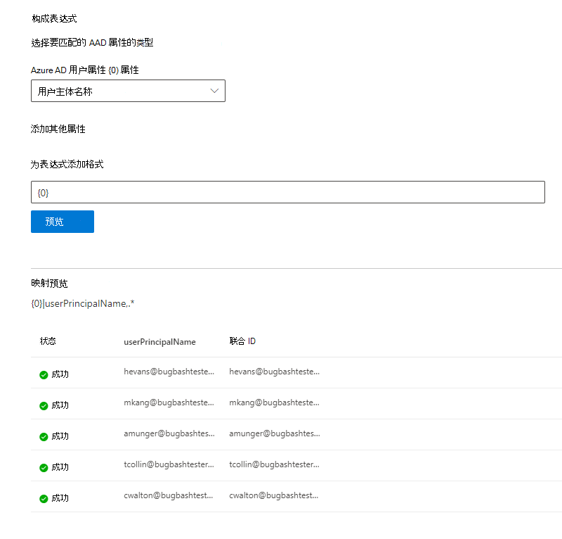

# 映射你的 Azure AD 标识  

本文将引导您完成以下步骤：将 Azure AD 标识映射到数据源的唯一标识符 (非 Azure AD 标识) 以便您的访问控制列表中的人员 (具有非 Azure AD 标识的 ACL) 可以查看其范围内的连接器搜索结果。

这些步骤仅与使用搜索权限为 Microsoft 设置 [Salesforce](salesforce-connector.md) 连接器的搜索管理员（"仅有权访问此数据源的人" 和标识类型 "AAD"）相关。 下面的步骤将引导您完成如何将 Azure AD 用户属性映射到用户的 **联合 id** 。

>[!NOTE]
>如果您正在设置 [Salesforce 连接器](salesforce-connector.md) ，并且仅选择 **具有此数据源访问权限的人员** 以及搜索权限屏幕上的标识类型 **非 AAD** ，请参阅 [映射您的非 azure ad 标识](map-non-aad.md) 一文，以了解有关如何映射非 azure ad 标识的步骤。  

## 映射 Azure AD 属性的步骤

### 1. 选择要映射的 Azure AD 用户属性

你可以选择需要映射到联合 ID 的 Azure AD 属性。

您可以从下拉列表中选择 Azure AD 用户属性。 如果需要这些属性来创建组织的联合 ID 映射，则还可以添加任意数量的 Azure AD 用户属性。

### 2. 创建用于完成映射的公式

你可以将 Azure AD 用户属性的值组合起来，以构成唯一联合 ID。

在 "公式" 框中，" {0} " 对应于您选择的 *第一个* Azure AD 属性。 " {1} " 对应于您选择的 *第二个* Azure AD 属性。 " {2} " 对应于 *第三个* Azure AD 属性，依此类推。  

下面是示例正则表达式输出和公式输出的一些公式示例：

| 示例公式                  | 示例用户的属性值 {0}                 | 示例用户的属性值 {1}           | 公式的输出                  |
| :------------------- | :------------------- |:---------------|:---------------|
| {0}.{1}@contoso .com  | 段 | lastname |firstname.lastname@contoso.com
| {0}@domain .com                 | userid                 |             |userid@domain.com

在提供公式之后，您可以选择单击 " **预览** " 以查看数据源中5个随机用户的预览，并应用各自的用户映射。 预览的输出包括在步骤1中为这些用户选择的 Azure AD 用户属性的值，以及针对该用户的步骤2中提供的最后一个公式的输出。 它还指示是否可以通过 "成功" 或 "失败" 图标将公式的输出解析为租户中的 Azure AD 用户。  

>[!NOTE]
>如果单击 " **预览** " 后，如果一个或多个用户映射的状态为 "失败"，则仍可以继续创建连接。 预览显示5个随机用户及其从您的数据源的映射。 如果您提供的映射不会映射所有用户，则可能会遇到这种情况。

## 示例 Azure AD 映射

有关 Azure AD 映射的示例，请参阅下面的快照。

## 限制  

- 所有用户仅支持一个映射。 不支持条件映射。  

- 一旦发布连接，便无法更改映射。  

- Azure ad 用户属性的基于 Regex 的表达式不支持 Azure AD 到联合 ID 转换。