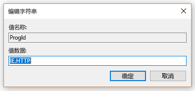

# 设置默认浏览器Set default browser

  
配置默认浏览器、默认搜索引擎和默认主页将帮助用户发现 Microsoft 搜索功能、鼓励更多用户使用，并提供更流畅的体验。Configuring the default browser, default search engine, and default homepage will help your users discover Microsoft Search capabilities, encourage more usage, and provide a smoother experience.
  
若要为组织设置默认浏览器，请按照下面步骤操作。To set the default browser for your organization, follow the steps below.
  
## Windows 8 及更高版本Windows 8 and above

要将 Internet Explorer 或 Microsoft Edge 设置为默认浏览器，请按以下步骤操作：To set Internet Explorer or Microsoft Edge as the default browser, follow these steps:
  
### 创建默认关联文件Create default associations file

1. 打开 PowerShell 管理控制台。Open an administrative PowerShell console.
    
2.  `New-Item -Path "\\$env:USERDOMAIN\SYSVOL\$env:USERDNSDOMAIN" -Type Directory -Name "Settings"`
    
3.  `$SettingsPath="\\$env:USERDOMAIN\SYSVOL\$env:USERDNSDOMAIN\Settings"`
    
4.  `Start-Process Dism.exe -PassThru "/Online /Export-DefaultAppAssociations:$SettingsPath\AppAssoc.xml"`
    
这些步骤尝试在域控制器的 SYSVOL 文件夹中创建默认关联文件。These steps try and create the default associations file in the SYSVOL folder of the domain controller.
  
### 添加或编辑默认关联文件Add or edit the default associations file

1. `Notepad "$SettingsPath\AppAssoc.xml"`
    
2. 编辑以下条目（.htm、.html、http、https），如果不需要，则删除其他条目。Edit the following entries (.htm, .html, http, https), and remove other entries if they're not needed.
    
  - **Microsoft Edge****Microsoft Edge**
    
     `<Association Identifier=".htm" ProgId="AppX4hxtad77fbk3jkkeerkrm0ze94wjf3s9" ApplicationName="Microsoft Edge" />`
  
     `<Association Identifier=".html" ProgId="AppX4hxtad77fbk3jkkeerkrm0ze94wjf3s9" ApplicationName="Microsoft Edge" />`
  
     `<Association Identifier="http" ProgId="AppXq0fevzme2pys62n3e0fbqa7peapykr8v" ApplicationName="Microsoft Edge" />`
    
  - **Internet Explorer****Internet Explorer**
    
     `<Association Identifier=".htm" ProgId="htmlfile" ApplicationName="Internet Explorer" />`
  
     `<Association Identifier=".html" ProgId="htmlfile" ApplicationName="Internet Explorer" />`
  
     `<Association Identifier="http" ProgId="IE.HTTP" ApplicationName="Internet Explorer" />`
  
     `<Association Identifier="https" ProgId="IE.HTTPS" ApplicationName="Internet Explorer" />`
    
3. 打开组策略管理控制台 (gpmc.msc) 并切换到编辑任何现有策略或新建一个策略。Open Group Policy Management Console (gpmc.msc) and switch to editing any existing policy or creating a new one.
    
1. 导航到**计算机配置\管理模板\Windows 组件\文件资源管理器**Navigate to **Computer Configuration\Administrative Templates\Windows Components\File Explorer**
    
2. 双击“设置默认关联配置文件”\*\*\*\*，将其设置为“已启用”\*\*\*\*，并输入访问 AppAssoc.xml 的路径（例如 %USERDOMAIN%\SYSVOL\%USERDNSDOMAIN%\Settings\AppAssoc.xml）Double-click **Set a default associations configuration file**, set it to **Enabled**, and enter the path to AppAssoc.xml (for example %USERDOMAIN%\SYSVOL\%USERDNSDOMAIN%\Settings\AppAssoc.xml)
    
4. 通过将生成的 GPO 链接到适当的域来强制执行。Enforce the resultant GPO by linking it to the appropriate domain.
    
用户将能够在设置此策略后更改浏览器。Users will be able to change the browser after this policy is set.
  
## Windows 7Windows 7

1. 配置将用于设置 GPO 的本地计算机。Configure the local machine that will be used to set the GPO.
    
1. 打开“控制面板\程序\默认程序\设置默认程序”\*\*\*\* 并将 Internet Explorer 设置为默认程序。Open **Control Panel\Programs\Default Programs\Set Default Programs** and set Internet Explorer as the default. 
    
2. 打开组策略管理控制台 (gpmc.msc) 并切换到编辑任何现有策略或新建一个策略。Open Group Policy Management Console (gpmc.msc) and switch to editing any existing policy or creating a new one.
    
1. 导航到**\<计算机/用户\>配置\策略\偏好设置\Windows 设置**。Navigate to **\<Computer/User\> Configuration\Policies\Preferences\Windows Settings**.
    
2. 右键单击“注册表\新建”\*\*\*\* 然后选择“注册表向导”\*\*\*\*。Right-click on **Registry\New** and select **Registry Wizard**.
    
3. 从注册表浏览器窗口中，选择“本地计算机”\*\*\*\*，然后单击“下一步”\*\*\*\*。From the Registry Browser window, select **Local Computer** and click **Next**.
    
4. 导航到 **HKEY_CURRENT_USER\Software\Microsoft\Windows\Shell\Associations\UrlAssociations\https** 并选择 ProgId 值。请确保值如下所示：Navigate to **HKEY_CURRENT_USER\Software\Microsoft\Windows\Shell\Associations\UrlAssociations\https** and select the ProgId value. Make sure the value looks like the one below: 
    
    
  
5. 导航到 **HKEY_CURRENT_USER\Software\Microsoft\Windows\Shell\Associations\UrlAssociations\https** 并选择 ProgId 值。请确保值如下所示：Navigate to **HKEY_CURRENT_USER\Software\Microsoft\Windows\Shell\Associations\UrlAssociations\https** and select the ProgId value. Make sure that the value looks like the one below: 
    
    
  
3. 通过将生成的 GPO 链接到适当的域来强制执行。Enforce the resultant GPO by linking it to the appropriate domain.
    
用户将能够在设置此策略后更改浏览器。Users will be able to change the browser after this policy is set.